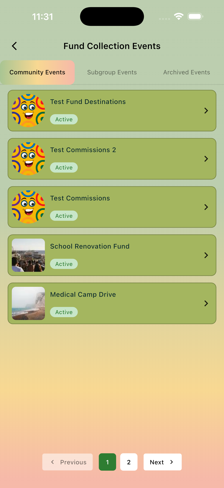
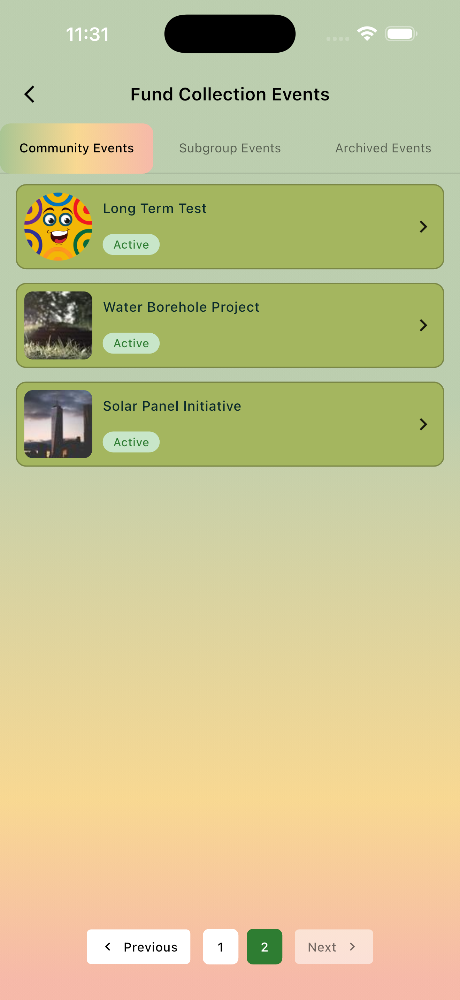
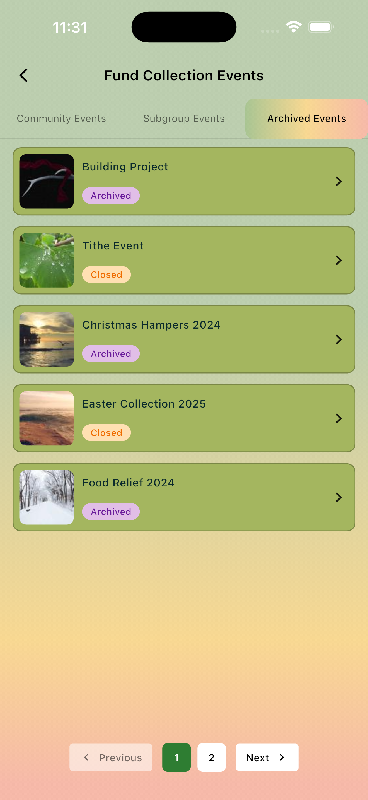

# Givva Assessment

Flutter assessment project for listing fundraiser events with tab-based filtering and pagination.

## Prerequisites

- Flutter SDK installed (stable channel)
- Dart SDK (bundled with Flutter)
- Xcode (for iOS on macOS) and/or Android Studio SDK tools
- A connected device or simulator/emulator

## Setup Steps

1. Unzip the file

2. Ensure Flutter is available:

```bash
flutter --version
flutter doctor
```

3. Install dependencies:

```bash
flutter pub get
```

4. Run the app:

```bash
flutter run
```

## Project Behavior

- Fundraiser data is loaded through the repository layer from local mock data.
- Tabs are: community, subgroup, archived.
- Pagination is driven by returned mock pagination metadata.
- Switching tabs restores the last visited page for that tab.
- Pull-to-refresh reloads the currently selected tab and page.

## Assumptions

- This build is mock-data driven; no live backend integration is required.
- `status == 200` indicates success; non-200 responses are treated as failures.
- Date fields may be null and are mapped according to model expectations.
- Default startup context is `community`, page `0`.

## Notes

- If no items are returned for a tab/page, an empty-state widget is shown.
- If loading fails, an error-state widget is shown with retry support.

## Screenshots

|                                                            |                                                            |
| ---------------------------------------------------------- | ---------------------------------------------------------- |
|  |  |
|   |                                                            |
